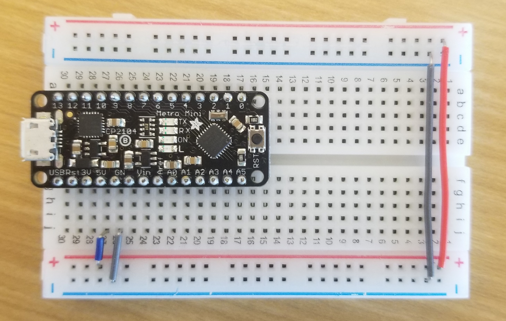
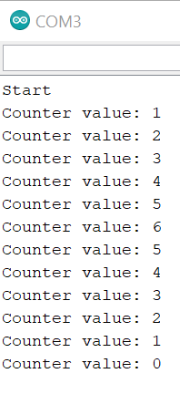

# Alt Lab 1
## Part 1 - Light It Up
### Part A. Set Up a Breadboard

### Part C. Blink LED Using Arduino
#### 1. Blink the On-Board LED
a. For the onboard LED, the program works as-is. To blink an external LED, the
pin being controlled must be switched to one of the digital outputs.  
b. To change the blink rate, the wait time must be modified.  
c. A resistor must be used to limit the current through the LED.  
d. I stop perceiving blinking with a period of about 25ms.  
e. Code can be found [here](./code/blink/blink.ino).
#### 2. Blink your LED
Video can be found [here](./media/blink.mp4)\.  
Code can be found [here](./code/blink_pin9/blink_pin9.ino)\.  
### Part D. Manually Fade LED
a. The LED does stay lit for the entire tuning range of the potentiometer.
Increasing the resistance only changes the current, not the voltage across the
LED, so its forward voltage remains met, and it simply gets dimmer as the resistance increases.
### Part E. Fade LED Using Arduino
a. The output pin must be changed to pin 11.  
b. analogWrite() controls a pulse-width modulated output -- a functionality
which is technically digital and doesn't really line up with the function name.
It differs from digitalWrite() in that it implements PWM.

## Part 2 - Make A Digital Timer!
### Part A. Solder Your OLED
Code can be found [here](./code/display_a0/display_a0.ino)\.  
### Part B. Make a Lowly Multimeter
Code can be found [here](./code/multimeter/multimeter.ino)\.  
Video of operation can be found [here](./media/multimeter.mp4)\.  
### Part C. Using a Time-Based Digital Sensor
I made the encoder output display on the OLED, but doing so seems to have slowed
the program enough that it sometimes misses or misreads encoder movements.
This could be fix ed by using some sort of interrupt to handle encoder movements.  
My code can be found [here](./code/encoder/encoder.ino)\.  
Here is a picture of the serial output.  

### Part D. Make Your Arduino Sing!
a. To double the playback rate, you would make noteDuration = 500/noteDurations[thisNote].  
b. It is playing the Star Wars theme.

### Part E. Make Your Own Timer
My timer allows you to adjust the time with the rotary encoder. You can start
the timer by pressing down on the encoder's pushbutton. The OLED will display a
MM:SS countdown, and, when it reaches 00:00, the speaker will buzz until you
press the pushbutton again.  
Code can be found [here](./code/timer/timer.ino)\.  
Video of operation can be found [here](./media/timer.mp4)\.
